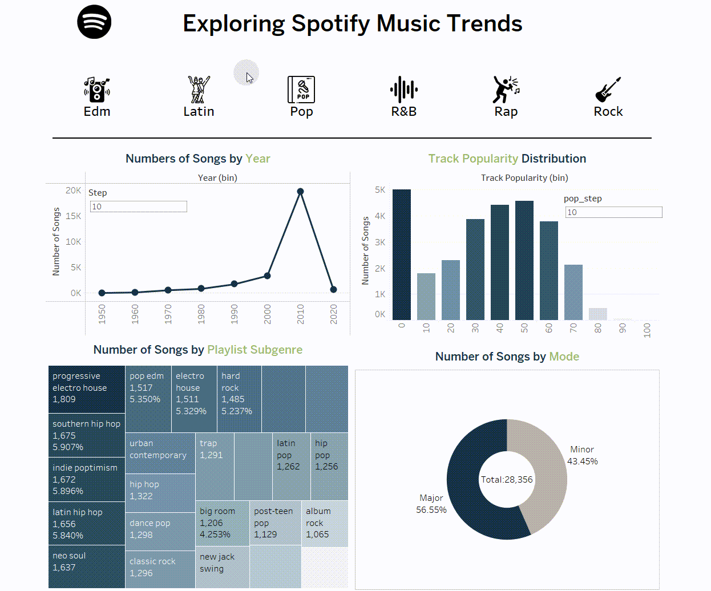
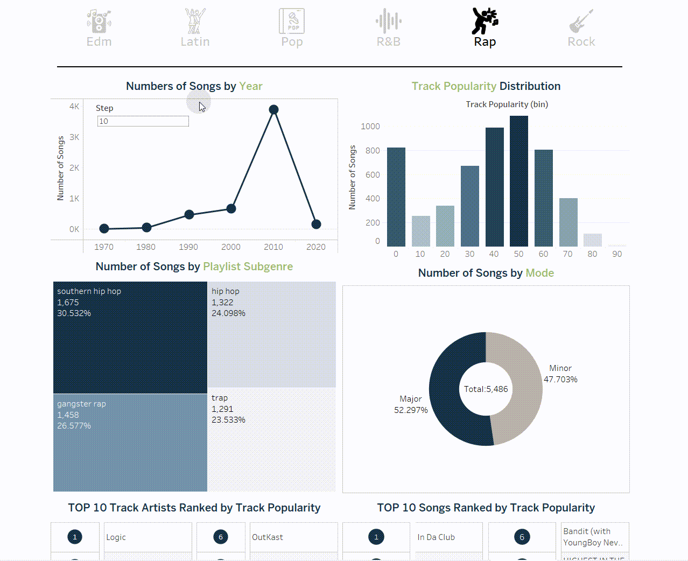
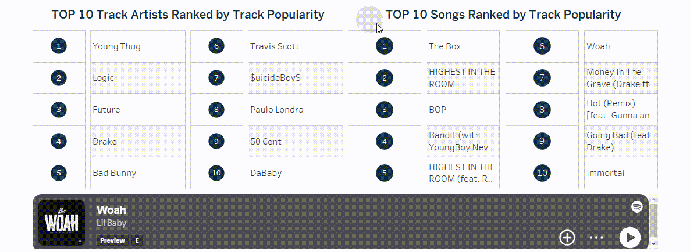

# Spotify Music Trends Interactive Dashboard

## Project Overview

This Tableau-based interactive dashboard provides an in-depth analysis of Spotify music trends, focusing on key insights such as:

- Yearly distribution of songs across genres.
- Popularity trends and song characteristics.
- Subgenre diversity within specific music types.
- Top tracks and artists based on user preferences.

The dashboard is designed to be fully interactive, allowing users to dynamically filter data and uncover unique insights.

---

## Key Features

1. **Genre Selection**:
   - Dynamically update the dashboard by selecting a specific music genre (e.g., "Pop" or "R&B").
   - Observe changes in yearly trends, popularity distribution, and subgenre composition.

2. **Advanced Filtering**:
   - Apply filters based on year, popularity range, and other criteria.
   - Visualize the impact of selected filters on the data distribution and gain focused insights.

3. **Top 10 Songs Playback**:
   - Interact with the Top 10 Songs list by clicking a track.
   - Initiate playback directly within the dashboard for a seamless listening experience.

---

## Demonstration GIFs

### 1. Genre Selection Interaction
**Objective**: Demonstrate the impact of selecting a music genre on the overall dashboard layout.
- **GIF**:  
  

### 2. Filter Interaction
**Objective**: Showcase the effect of applying filters to a specific section of the dashboard.  
- Example: Rap genre, 2000-2020, popularity > 60.  
- **GIF**:  
  

### 3. Top 10 Songs Playback
**Objective**: Highlight the song playback feature within the dashboard.  
- **GIF**:  
  

---

## Insights Example (Based on Demonstrations)

1. **Genre Trends**:
   - R&B and Latin genres show consistent growth post-2000, reflecting their mainstream appeal.

2. **Popularity Distribution**:
   - Rap songs with popularity > 60 (2000-2020) are predominantly in "Trap" and "Hip Hop" subgenres.

3. **Listening Preferences**:
   - Users are more inclined towards upbeat songs in major keys, as seen in high-ranked tracks.

---

## How to Access the Dashboard

**Static Visualization**:
  - [Download Static Dashboard Screenshot](#)

---

## Acknowledgements
This project leverages Spotify data for educational and analytical purposes. Special thanks to Tableau for providing an excellent platform for interactive visualizations.
